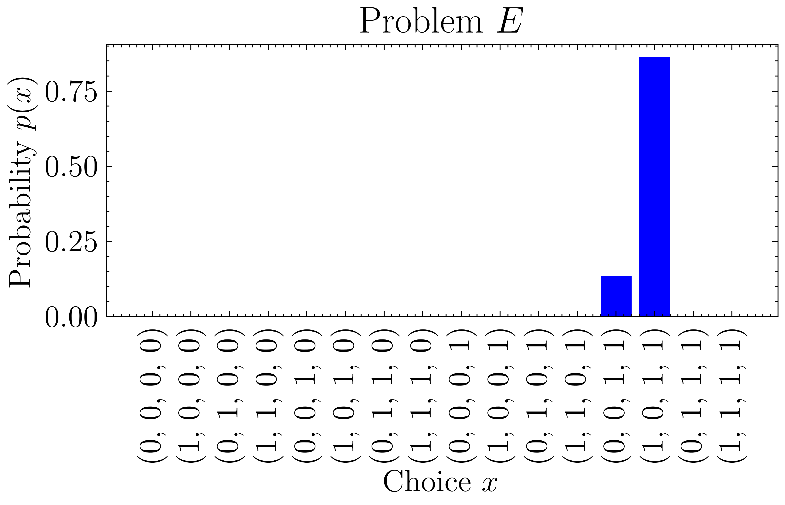

# QAOA for the Knapsack-based EV Charging Problem

This is the offical implementation of the paper: \
**Leveraging Knapsack QAOA Approach for Optimal Electric Vehicle Charging (Accepted)**\
Mr. Kimleang Kea, Ms. Chansreynich Huot, Professor. Youngsun Han

## Abstract

The Electric Vehicle (EV) charging problem is a challenging optimization task, aiming to efficiently charge numerous vehicles within constraints like limited power supply and extended waiting times due to high vehicle demands. We propose a novel approach that utilizes the Quantum Approximation Optimization Algorithm (QAOA) to tackle this problem. By incorporating a knapsack problem constraint into QAOA, we overcome its limitations and provide a potential solution. Our approach achieves an impressive approximation ratio of up to 100% in noise-free and 50% in noisy environments, even with low circuit sizes. This research presents a promising step towards efficiently addressing EV charging issues through quantum-inspired algorithms.

## Introduction

The knapsack problem is a well-known optimization problem that aims to maximize the value of items in a knapsack while keeping the total weight below a certain threshold. In the EV problem scenario, the knapsack problem is used to determine the number of vehicles that can be charged within a limited power supply. However, it is known as NP-hard problem which is difficult to solve in polynomial time. Therefore, QAOA comes to a rescue as it is a quantum-inspired algorithm that can solve the knapsack problem in polynomial time. The performance of QAOA is evaluated in approximation ratio, which is the ratio between the optimal solution and the solution obtained by QAOA. The higher the approximation ratio, the better the performance of QAOA.


*<center>**Figure 1**: An overview of the full circuit for designing the QAOA. The Subroutine 1 is Power Computation. The Subroutine 2 is Constraint Testing. The Subroutine 3 is Penalty Dephasing. The Subroutine 4 is Reinitialization.</center>*

## Installation

To install the required packages, run the following command:

```bash
pip install -r requirements.txt
```

## Files

| File Name | Description |
| --- | --- |
| a_penalty.py | Class to get approximation ratio based the penalty $\alpha$ value. |
| circuits.py | Class to define the circuit required to build the QAOA algorithm, including all QAOA components and Subroutines. |
| EV_knapsack.py | Class to define the knapsack problem with power_required, time_required and max power supply for each EV. |
| main.py | Main file to run the QAOA algorithm to get the probability distribution (optimal solution). |
| plot.py | Class to plot the probability distribution and the approximation ratio. |
| qaoa.py | Class to define the QAOA algorithm constructed from `circuits.py`. |
| utils.py | Class to define required function to calculate the QAOA parameters and results. |

## Usage

1. To run the QAOA algorithm in order to get the probability distribution, run the following command:

```bash
python main.py
```

2. To run the QAOA algorithm in order to get the approximation ratio, run the following command:

```bash
python a_penalty.py
```

## EV Knapsack Problem Instances

<!-- Table -->
| Problem | Power Required | Time Required | Max Power | Optimal Solution |
| --- | --- | --- | --- | --- |
| $A$ | [1, 2] | [1, 1] | 1 | (1, 0) |
| $B$ | [1, 2] | [1, 1] | 2 | (1, 1) |
| $C$ | [1, 1, 2] | [1, 1, 1] | 2 | (1, 1, 0) |
| $D$ | [1, 2, 3] | [1, 2, 3] | 3 | (1, 1, 0) |
| $E$ | [2, 3, 1, 1] | [2, 2, 1, 1] | 4 | (1, 0, 1, 1) |

## Results

The results are shown in the following figures:

### Probability Distribution

Each subplot showcases the corresponding probability
distributions for the depth p = 3 and penalty a = 10. 

In Figure 2,
the probability distribution prominently peaks at the choice
of (1, 1, 0), indicating that the EVs with time required at
index 0 and 1 and power required at index 0 and 1, are
the preferred selections.


*<center>**Figure 2**: The probability distribution of the optimal solution for Problem C.</center>*

In Figure 3, the outcomes
reveal a strong preference for the choice (1, 0, 1, 1), signifying
the selection of EVs time and power required at index 0,
2, and 3. However, the outcome of Problem E indicates a
probability associated with a non-optimal choice (0, 0, 1, 1).


*<center>**Figure 3**: The probability distribution of the optimal solution for Problem E.</center>*

### Approximation Ratio

The approximation ratio for depth p = 3 and penalty a = 10 for all problems. The approximation ratio achieves an approximation ratio of 100% for all problems when the depth p >= 4.


## Citation
ADD BIBTEX HERE
<!-- If you use this code for your research, please cite our paper: -->

```
@ARTICLE{10267926,
  author={Kea, Kimleang and Huot, Chansreynich and Han, Youngsun},
  journal={IEEE Access}, 
  title={Leveraging Knapsack QAOA Approach for Optimal Electric Vehicle Charging}, 
  year={2023},
  volume={11},
  number={},
  pages={109964-109973},
  doi={10.1109/ACCESS.2023.3320800}}
}
```

## LICENSE

[](https://github.com/KimleangSama/flad_in_eps/blob/main/LICENSE)
